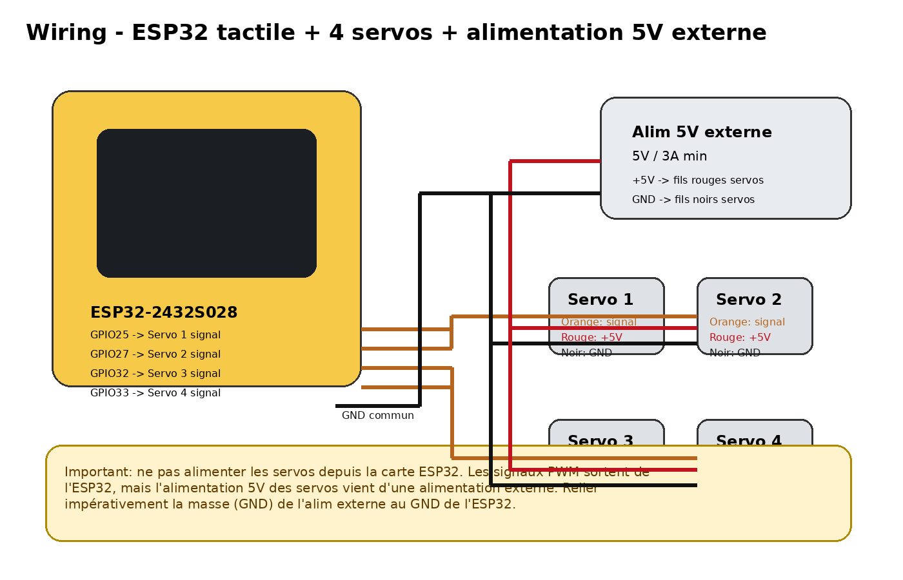

# Hardware

## Choix retenu

### Carte principale
- **ESP32-2432S028**
- écran TFT 2.8"
- tactile résistif
- très économique
- assez de GPIO pour un petit robot à 4 servos

Cette famille de cartes existe en plusieurs variantes ; la documentation publique confirme l'intégration d'un écran 2.8", d'un ESP32, et l'exposition d'une partie des GPIO sur connecteurs latéraux/arrière. citeturn912039image1turn912039image8

## Pourquoi ce choix

- moins cher qu'un empilage ESP32 + écran + shield
- moins de câblage
- format compact à intégrer sur le robot
- assez puissant pour gérer l'UI et 4 sorties servo

## Alimentation

### Règle impérative
Les servos ne doivent pas être alimentés par le 5V logique de la carte ESP32.

### Câblage d'alimentation
- alimentation externe 5V / 3A minimum
- +5V alimentation -> fils rouges des 4 servos
- GND alimentation -> fils noirs des 4 servos
- GND alimentation -> GND ESP32

Les tutoriels de pilotage servo sur ESP32 recommandent explicitement une alimentation externe pour le ou les servos, avec masse commune. citeturn912039image2turn912039image4

## GPIO proposés

> À valider sur la variante exacte de ta carte avant soudure définitive.

- Servo 1 -> GPIO25
- Servo 2 -> GPIO27
- Servo 3 -> GPIO32
- Servo 4 -> GPIO33

## Schéma de principe

## Photos / références visuelles

Carte ESP32 tactile typique :  
- vue produit et format général. citeturn912039image0turn912039image3

Exemple de principe de câblage d'un servo sur ESP32 avec alimentation externe :  
- principe de signal PWM + 5V externe + GND commun. citeturn912039image2turn912039image4

## Liste d'achat minimale

- 1 x ESP32-2432S028
- 4 x servos existants du robot
- 1 x alimentation 5V 3A minimum
- fils Dupont / JST selon ton montage
- 1 x interrupteur général (option recommandé)
- 1 x condensateur 1000 µF sur l'alimentation servo (recommandé)

## Risques connus

- redémarrages de l'ESP32 si l'alimentation servo est sous-dimensionnée
- bruit électrique sur les signaux si les masses sont mal câblées
- conflit possible de GPIO selon la variante exacte de la carte tactile
