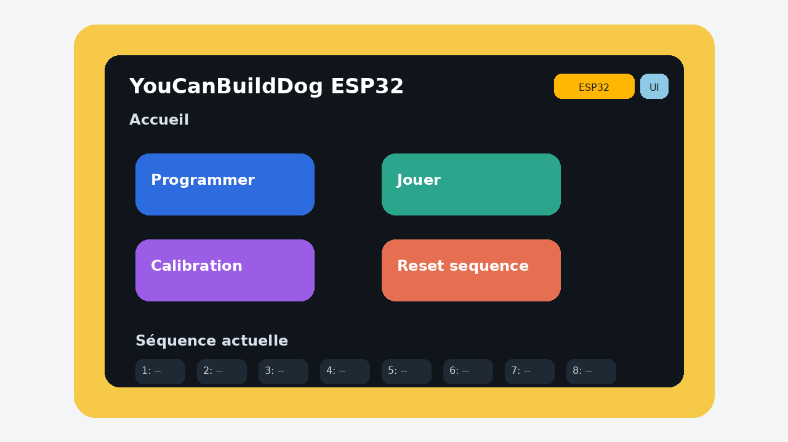
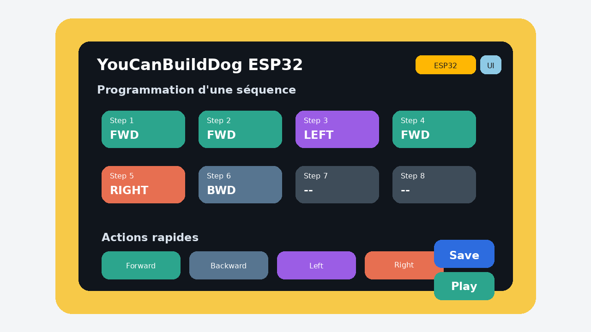
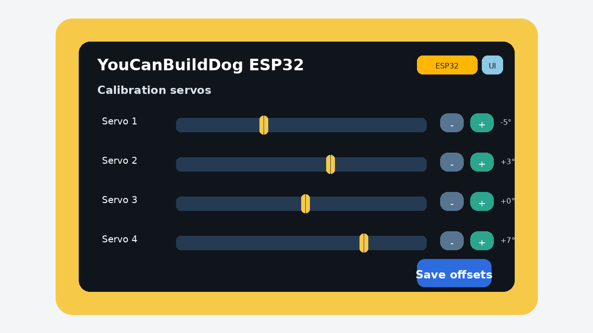

# Interface tactile proposée

L'objectif est de rester **très simple**, sans réinventer la logique du robot d'origine.

## Écran 1 — Accueil

Fonctions :
- Programmer
- Jouer
- Calibration
- Reset séquence

Maquette :

## Écran 2 — Programmation

Principe :
- 8 slots de séquence
- chaque slot reçoit une action
- actions minimales :
  - Forward
  - Backward
  - Left
  - Right

Maquette :

## Écran 3 — Calibration

Principe :
- un offset par servo
- boutons `-` et `+`
- sauvegarde persistante

Maquette :

## Ergonomie visée

- gros boutons tactiles
- texte lisible
- pas de menus complexes
- pas d'édition libre compliquée

## Mapping fonctionnel conseillé

Pour coller au sketch d'origine :

- `motion1..motion8` -> 8 cases écran
- `walkAction` -> action sélectionnée
- `sw5` (play) -> bouton **Play**
- `sw6` (reset) -> bouton **Reset**

## Sauvegarde

Deux niveaux possibles :
- séquence courante seulement
- séquence courante + offsets

Pour un premier portage, sauvegarder seulement :
- 8 actions
- 4 offsets servo
